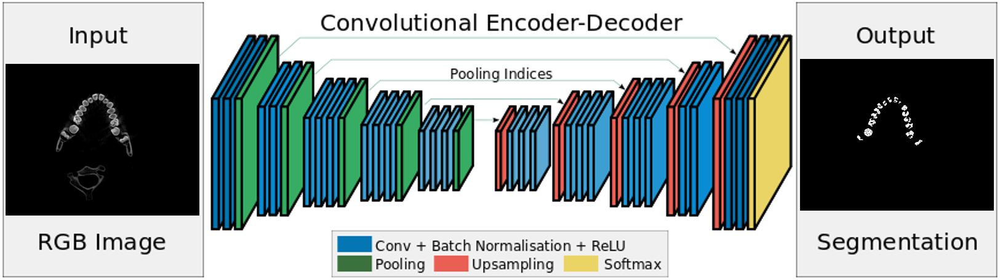
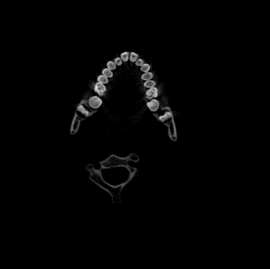
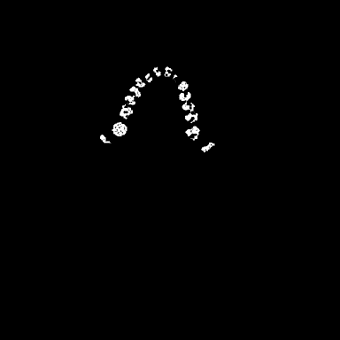
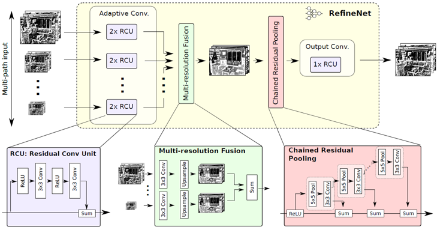
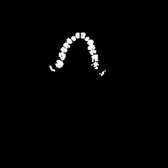
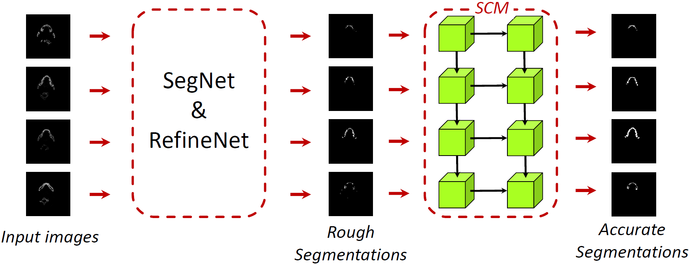
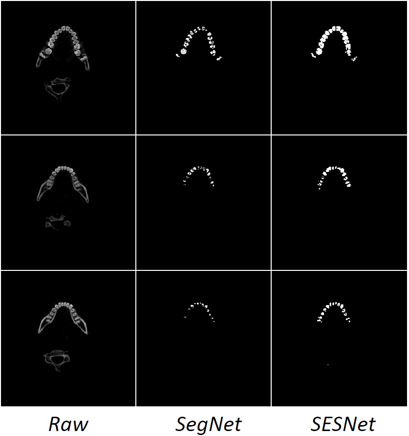
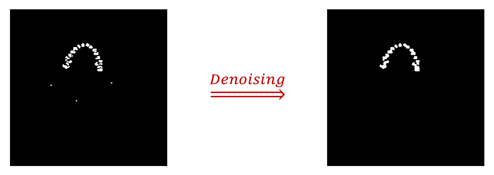
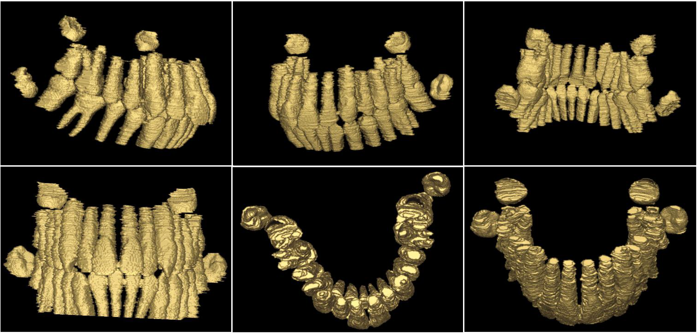

# 3D Teeth Reconstruction from CT Scans

This is the code for Computer Graphics course project in 2018 Fall to conduct 3D teeth reconstruction from CT scans, maintained by Kaiwen Zha and Han Xue.

## Overview
  [3D Teeth Reconstruction from CT Scans](#3d-teeth-reconstruction-from-ct-scans)
  - [Overview](#overview)
  - [Dataset Annotation](#dataset-annotation)
  - [SegNet](#segnet)
    - [Dependencies](#dependencies)
    - [Preparation](#preparation)
    - [Training Phase](#training-phase)
    - [Evaluating Phase](#evaluating-phase)
    - [Qualitative Results](#qualitative-results)
  - [RefineNet](#refinenet)
    - [Dependencies](#dependencies-1)
    - [Preparation](#preparation-1)
    - [Training Phase](#training-phase-1)
    - [Evaluating Phase](#evaluating-phase-1)
    - [Qualitative Results](#qualitative-results-1)
  - [SESNet](#sesnet)
    - [Dependencies](#dependencies-2)
    - [Preparation](#preparation-2)
    - [Training Phase](#training-phase-2)
    - [Evaluating Phase](#evaluating-phase-2)
    - [Quantitative Results](#quantitative-results)
    - [Qualitative Results](#qualitative-results-2)
  - [3D Reconstruction](#3d-reconstruction)
    - [Image Denoising](#image-denoising)
    - [Image Interpolation](#image-interpolation)
    - [3D Visualization](#3d-visualization)
    - [Demonstration](#demonstration)
  - [Contributors](#contributors)
  - [Acknowledgement](#acknowledgement)

## Dataset Annotation

Since our given dataset only contains raw CT scan images, we manually annotate the segmentations of 500 images using [js-segment-annotator](https://github.com/kyamagu/js-segment-annotator). You can download our dataset from [here](https://jbox.sjtu.edu.cn/l/R092lj).

## SegNet

We use [SegNet](http://mi.eng.cam.ac.uk/projects/segnet/) as one of our base networks to conduct segmentation. We feed our annotated training data and train the network end-to-end, and evaluate it on our annotated testing data. 



### Dependencies

- Python 3.6
- TensorFlow 1.5.0
- Numpy
- Scipy

### Preparation

- Download our pretrained models from [here](https://jbox.sjtu.edu.cn/l/AJTFJt).
- Put the downloaded dataset /Images and /Labels into folder /Data/Training and /Data/Test.
- Put our pretrained models /Run_new into folder /Output.

### Training Phase

- Run the training phase

```bash
python train.py
```

- Start tensorboard in another terminal

```bash
tensorboard --logdir ./Output --port [port_id]
```

### Evaluating Phase

- Run the evaluating phase

```bash
python test.py
```

Note that you should have pretrained models /Run_new on folder /Output, and the predicted segmentations will be located in folder /Output/Run_new/Image_Output.

### Qualitative Results

<div align="center">
    
    
</div>

## RefineNet

We also adopt [RefineNet](https://github.com/guosheng/refinenet) as our another base network to conduct segmentation. Here, we also use our annotated data to train and evaluate, and the code is finished by us from scratch, which implements with **two interfaces for RefineNet and SESNet respectively**.



### Dependencies

- Python 2.7

- TensorFlow 1.8.0

- Numpy

- OpenCV

- Pillow

- Matplotlib

### Preparation

- Download the checkpoint for ResNet backbone, TFRecords for training and testing data, generated color map, and our pretrained models from [here](https://jbox.sjtu.edu.cn/l/yo7MaQ).
- Put the downloaded dataset /images and /labels into folder /data.
- Put the ResNet checkpoint `resnet_v1_101.ckpt`, color map `color_map`, training and testing TFRecords `train.tfrecords` and `test.tfrecords` into folder /data.
- Put our pretrained models into folder /checkpoints.

### Training Phase

- If you have not downloaded the TFRecords, convert training and testing data into TFRecords by running

```bash
python convert_teeth_to_tfrecords.py
```

- If you have not downloaded the color map, produce color map by running

```bash
python build_color_map.py
```

- Run the training phase **(enable multi-gpu training by tower loss)**

```bash
python SESNet/multi_gpu_train.py --model_type refinenet
```

Note that you can assign other command line parameters for training, like `batch_size`, `learning_rate`, `gpu_list` and so on.

### Evaluating Phase

- Run the evaluating phase

```bash
python SESNet/test.py --model_type refinenet --result_path ref_result
```

Note that you should have trained models on folder /checkpoints, and the predicted segmentations will be located in folder /ref_result.

### Qualitative Results

<div align="center">
    
    
</div>

## SESNet

This architecture is proposed by us. First, we use base networks (SegNet or RefineNet) to predict rough segmentations. Then, use **Shape Coherence Module (SCM)**, composed by 2-layer ConvLSTM, to learn the fluctuations of shapes to improve accuracy.



### Dependencies

The same as the dependencies of RefineNet.

### Preparation

The same as in RefineNet.

### Training Phase

- Generate TFRecords for training and testing, and color map as in RefineNet does.
- Run the training phase **(enable multi-gpu training by tower loss)**
```bash
python SESNet/multi_gpu_train.py --model_type sesnet
```
Note that you can assign other command line parameters for training as well, like `batch_size`, `learning_rate`, `gpu_list` and so on.

### Evaluating Phase

- Run the evaluating phase

```bash
python SESNet/test.py --model_type sesnet --result_path ses_result
```

Note that you should have trained models on folder /checkpoints, and the predicted segmentations will be located in folder /ses_result.

### Quantitative Results

|           | Pixel Accuracy |   IoU    |
| :-------: | :------------: | :------: |
|  SegNet   |      92.6      |   71.2   |
| RefineNet |      99.6      |   78.3   |
|  SESNet   |    **99.7**    | **82.6** |

### Qualitative Results



## 3D Reconstruction

### Image Denoising

We use **Morphology-based Smoothing** by combining *erosion* and *dilation* operations.

- We implemented it with MATLAB. Begin denoising by running

```matlab
denoising(inputDir, outputDir, thresh);
```

Note that `inputDir` is the folder for input PNG images, `outputDir` is the folder for output PNG images, and `thresh` is the threshold for binarizing (0~255).

### Image Interpolation

In order to reduce the gaps between different layers, we use interpolation between 2D images to increase the depth of 3D volumetric intensity images. 

- We implemented it with MATLAB. Begin interpolating by running

```matlab
interpolate(inputDir, outputDir, new_depth, method)
```

Note that `inputDir` is the folder for input PNG images, `outputDir` is the folder for output PNG images, `new_depth` is the new depth for 3-D volumetric intensity image, and `method` is the method for interpolation, which could be `linear', 'cubic', 'box', 'lanczos2' or 'lanczos3'.

- Convert continuous PNG files to RAW format (volume data) by running

```bash
python png2raw.py -in input_dir -out output_dir
```

### 3D Visualization

We use **surface rendering** for 3D Visualization. We adopt [Dual Marching Cubes](https://dl.acm.org/citation.cfm?id=1034484) algorithm to convert 3D volumetric intensity image into surface representation. This implementation requires C++11 and needs no other dependencies.

- To build the application and see the available options in a Linux environment type

```bash
$ make
$ ./dmc -help
```

A basic CMAKE file is provided as well.

- Extract a surface (OBJ format) from the volume type (RAW format) by running

```bash
$ ./dmc -raw FILE X Y Z
```

Note that `X, Y, Z` are used to specify RAW file with dimensions.

- Display OBJ file by using software such as 3D Model Viewer or using our provided MATLAB function

```matlab
obj_display(input_file_name);
```

### Demonstration



## Contributors

This repo is maintained by [Kaiwen Zha](https://github.com/Sunshine-KaiwenZha), and [Han Xue](https://github.com/xiaoxiaoxh).

## Acknowledgement

Special thanks for the guidance of Prof. Bin Sheng and TA. Xiaoshuang Li.